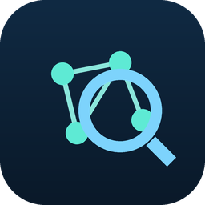

# ThreadLens Home Assistant Integration



HACS-compatible custom integration for [ThreadLens Core](https://github.com/theaussiepom/threadlens).

<br clear="left" />

This is the **Home Assistant / HACS integration** for ThreadLens. ThreadLens Core must already be
running separately. This integration provides a **ThreadLens sidebar dashboard/panel** inside Home
Assistant, powered by the ThreadLens REST API through the Home Assistant backend — not MQTT
Discovery entities.

**Status: early / pre-1.0** (version `0.1.2`). Behaviour and dashboard layout may change before 1.0.

## What this integration does

- Connects to a running ThreadLens Core REST API
- Adds a **ThreadLens** sidebar panel with an out-of-the-box dashboard for Thread / Matter / OTBR /
  mDNS / TREL health — no manual Lovelace YAML or custom cards required
- Shows a **network incident summary** (OK / Watch / Incident) so you can tell at a glance whether a
  Matter-over-Thread problem looks device-local or network-wide
- Surfaces **at-a-glance Matter node health** (Unavailable / Recently unstable / Healthy / Unknown),
  with click-through node detail showing recent events and a conservative assessment
- Aggregates `/api/v1` data in the backend (including a bounded 24h event window) and serves it to the
  panel over the authenticated Home Assistant websocket (`threadlens/dashboard`), so the panel never
  talks to ThreadLens directly
- Opens the ThreadLens YAML report in a new tab through an authenticated Home Assistant proxy
  (`/api/threadlens/report.yaml`) — no CORS, mixed-content, or local-network auth issues
- Exposes a small set of secondary helper sensors, binary sensors, and buttons for automations
- Provides diagnostics for integration troubleshooting

Foreign Thread/TREL services on your LAN (HomePods, Apple TVs, Nest, other fabrics) are treated as
**informational** and do not, by themselves, make the dashboard look unhealthy. A reconciled OTBR REST
endpoint mismatch (JSON:API disagrees with `/node` while an active Thread role is known) is likewise
shown as a detail rather than a prominent warning. Raw reason codes remain available in diagnostics.

The dashboard **does not depend on MQTT Discovery**. MQTT Discovery remains optional for normal Home
Assistant entities and automations.

## What this integration does not do

- Does not mutate Thread, Matter, or OTBR state
- Does not commission devices
- Does not require SSH, Docker socket, or log scraping
- Does not observe mDNS, poll OTBR REST APIs, or connect to Matter Server websockets directly
- Does not publish MQTT Discovery entities (ThreadLens Core does this when MQTT is enabled)
- Does not auto-create Lovelace dashboards or require custom cards
- Does not add API authentication (ThreadLens v1 has none)

## Requirements

ThreadLens Core must be running separately:

- [ThreadLens Docker container](https://github.com/theaussiepom/threadlens)
- [ThreadLens HAOS add-on](https://github.com/theaussiepom/threadlens-ha-addon)

Example API URLs:

```text
http://homeassistant.local:8128
http://threadlens.local:8128
```

## Install with HACS

1. In HACS, open **Settings → Custom repositories**
2. Add repository: `https://github.com/theaussiepom/threadlens-ha-integration`
3. Category: **Integration**
4. Install **ThreadLens** from HACS
5. Restart Home Assistant
6. Go to **Settings → Devices & services → Add integration**
7. Search for **ThreadLens** and enter your ThreadLens API URL (no trailing slash required)

## Manual install

Copy `custom_components/threadlens` into your Home Assistant `config/custom_components/` directory
and restart Home Assistant.

## Configuration

The config flow asks for your ThreadLens Core base URL:

```yaml
url: "http://homeassistant.local:8128"
```

Validation calls:

- `GET /api/v1/version`
- `GET /api/v1/health`

## Where to find the dashboard

After adding the integration, look for **ThreadLens** in the Home Assistant left sidebar (icon
`mdi:access-point-network`). The panel registers on setup — a restart is only required after the
initial HACS install. The panel fetches data from Home Assistant, which polls ThreadLens Core every
60 seconds; use the **Refresh** button for an immediate update.

### After a HACS update

Home Assistant may keep an old copy of the panel JavaScript in your browser cache. If the dashboard
looks unchanged after updating ThreadLens in HACS (for example, you still see the old Matter section
instead of **Matter node health**), do all of the following:

1. Confirm HACS installed the new version (`manifest.json` should show the updated version under
   `/config/custom_components/threadlens/`)
2. **Restart Home Assistant**
3. **Hard-refresh your browser** on the ThreadLens panel page:
   - macOS: **Cmd+Shift+R**
   - Windows/Linux: **Ctrl+Shift+R**
4. If needed, open the panel in a private/incognito window to bypass cache entirely

The panel header also reminds you to hard-refresh after HACS updates.

## The ThreadLens dashboard

The dashboard shows:

- **Header** — API connected/disconnected state, ThreadLens Core version, last refresh, refresh button
- **Network incident summary** — OK / Watch / Incident assessment
- **Overall health** — overall and environment state with friendly reason chips
- **Summary cards** — OTBRs, Thread networks, Matter nodes, mDNS services, TREL services, MQTT
- **Matter node health** — grouped, sorted, clickable node rows with health badges. Node names prefer
  your **Home Assistant Matter device/entity names** (e.g. blind names) when ThreadLens can match
  them; Matter serials remain visible as secondary detail.
- **OTBR section** — per-OTBR reachability, effective state, network, reconciled mismatch details
- **Matter servers** — server connectivity summary
- **mDNS / TREL section** — service counts, foreign TREL (informational), observation-degraded state
- **Report section** — open YAML via authenticated HA proxy, or copy the Core report URL
- **Diagnostics** — expandable raw JSON summaries

### Expected warnings

| Reason code | Meaning shown |
|-------------|---------------|
| `otbr_rest_endpoint_mismatch` | OTBR REST endpoints disagree |
| `foreign_trel_services_observed` | Other Thread/TREL services visible |
| `mdns_service_flapping_degraded` | mDNS service add/remove instability |
| `otbr_thread_stack_disabled` | OTBR Thread stack disabled |

When an OTBR reports `rest_endpoint_mismatch`, the panel notes that JSON:API reports disabled while
the legacy `/node` endpoint reports active, and that ThreadLens is using the active `/node` state.
It does not claim a root cause.

## Screenshots

> Screenshots are not available yet. Placeholders:
>
> - `docs/dashboard-overview.png` — header + overall health + summary cards
> - `docs/dashboard-otbr.png` — OTBR section with a REST endpoint mismatch warning

## Entities created by this integration

Secondary helper entities only — useful for automations, not required for the dashboard.

### Sensors

- `sensor.threadlens_api_health`
- `sensor.threadlens_environment_health`
- `sensor.threadlens_last_report_generated_at`
- `sensor.threadlens_event_count_24h`
- `sensor.threadlens_warning_count_24h`

### Binary sensors

- `binary_sensor.threadlens_api_connected`
- `binary_sensor.threadlens_mqtt_connected`
- `binary_sensor.threadlens_mdns_observer_running`

### Buttons

- `button.threadlens_refresh`
- `button.threadlens_generate_report`

## Dashboard architecture

- Backend: config flow, REST API client, data update coordinator
- Coordinator aggregates `/api/v1/version`, `/status`, `/health`, `/otbrs`, `/networks`,
  `/matter-servers`, `/matter-nodes`, `/mdns/services`, and `/trel/services`
- Websocket command `threadlens/dashboard` serves the aggregated payload
- Panel JS is bundled at `custom_components/threadlens/panel/threadlens-panel.js` — no external CDN

## Troubleshooting

| Issue | Action |
|-------|--------|
| Cannot connect | Verify ThreadLens is running and URL reachable from HA host |
| Panel missing | Confirm integration is configured; check HA logs for `threadlens` |
| Empty data | Wait for coordinator poll (60s) or press **Refresh** |
| Reports not updating | Press **Generate report** or call core API directly |
| MQTT entities missing | Enable MQTT in ThreadLens Core and HA MQTT integration (optional for dashboard) |

## Security

ThreadLens v1 has **no API authentication**. Use on a trusted LAN only. Do not expose ThreadLens
ports publicly without a reverse proxy and auth. Reports redact secrets in core ThreadLens but still
include operational metadata. See [SECURITY.md](SECURITY.md).

## Development / tests

```bash
cd threadlens-ha-integration
pip install aiohttp pytest pytest-asyncio ruff
ruff check custom_components tests
ruff format --check custom_components tests
pytest tests/ -q
node --check custom_components/threadlens/panel/threadlens-panel.js
```

Release checklist: [RELEASE.md](RELEASE.md)

## Related projects

- Core: https://github.com/theaussiepom/threadlens
- HAOS add-on: https://github.com/theaussiepom/threadlens-ha-addon

## License

MIT — Copyright (c) 2026 Ben Dennis. See [LICENSE](LICENSE).
